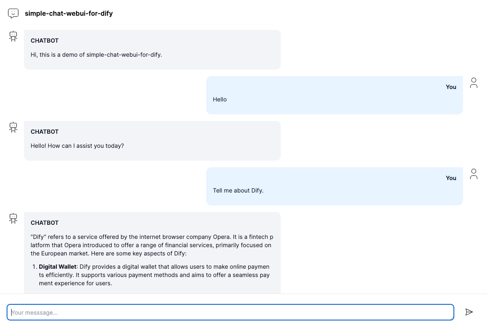
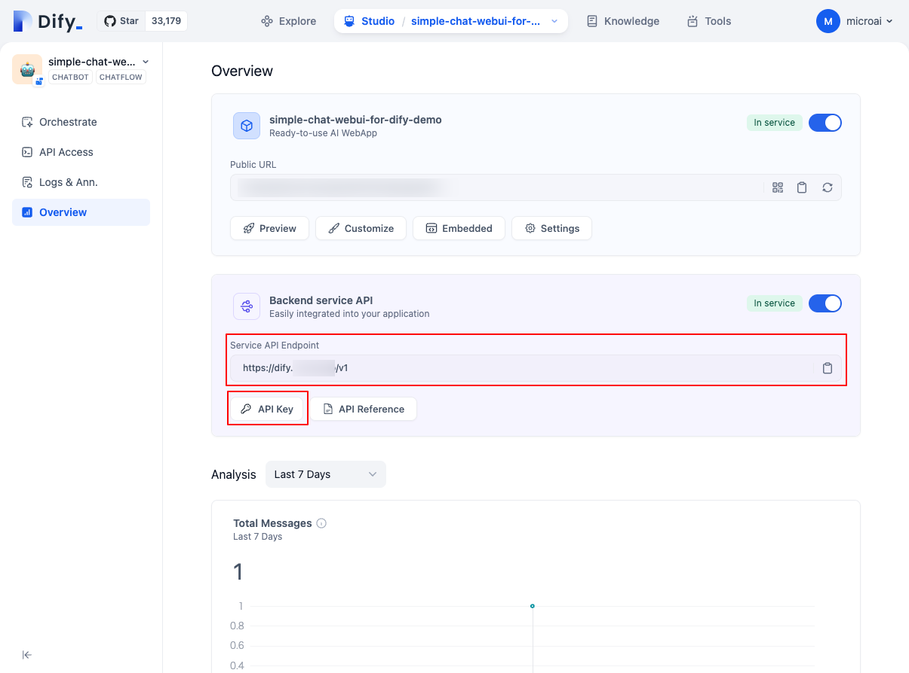
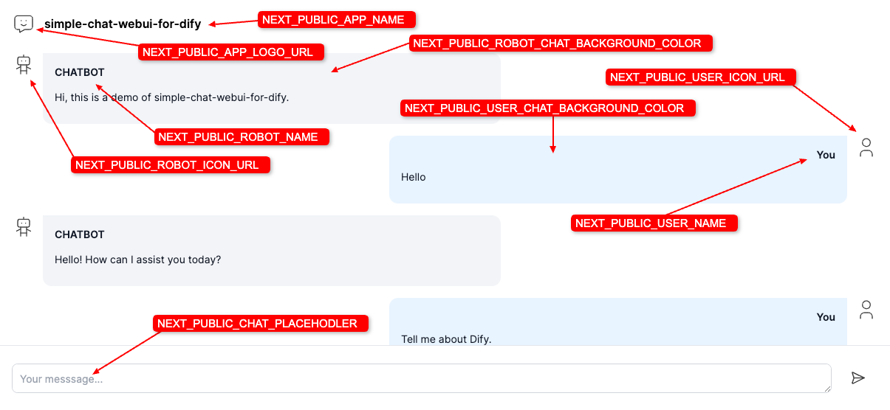
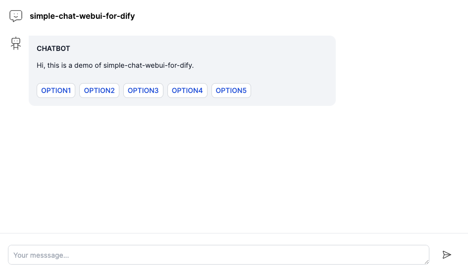

このプロジェクトは、Dify用のNext.js製の非常にシンプルなウェブUIです。
レスポンシブルで、スマートフォンにも対応しています。

プログラミング勉強中なのであまり期待しないでください :P

## Getting Started

### .env の設定
スクリーンショットを参考に、最低限、以下の２項目の設定を行ってください。
```
DIFY_APP_API_BASE_URL=https://xxxxx.xxxx.xxx/v1
DIFY_APP_API_KEY=app-XXXXXXXXXXXXXX
```


### ローカルで実行
以下の２ステップで起動できます。
```
npm install
npm run dev
```

[http://localhost:3000](http://localhost:3000) をブラウザで開いて確認してください。

## カスタマイズ
.env でカスタマイズすることができます


## BASIC認証
```
AUTH_MODE="BASIC"
BASIC_AUTH_USER="basic_user"
BASIC_AUTH_PASSWORD="basic_pass"
```
`AUTH_MODE`を`BASIC`にすることで、BASIC認証をかけることができます。
認証が不要な場合は、空に設定してください。

## Change log

### v0.0.6
ライブラリの互換性エラーを修正


### v0.0.5
Next.js の最新版 15.4.2 にバージョンアップしました。
加えて、これにより発生する不具合を修正しました。


### v0.0.4

メンテナンス機能を実装しました。  
Difyのサーバーに接続ができない場合、自動的にメンテナンス画面に切り替わります。  
表示するテキストは  
.env `NEXT_PUBLIC_MAINTENANCE_TITLE` `NEXT_PUBLIC_MAINTENANCE_BODY` で設定可能です


### v0.0.3
Google Tag Manager に対応しました。
.env にてGTMIDを指定してください。
利用しない場合は空のままにします。

Example: `GTM-KZR8CDNR`

.env
```
###### GoogleTagManager
GTMID=
```

### v0.0.2
開始質問 (OPENING QUESTIONS) に対応しました。



## Deploy on Vercel
Server-Sent Events を使用しているので、Vercel でも動きます。
ただし、無料プランでは時間の制限により、チャットが途中で途切れてしまうことがあります。

## Dify 開発チームへの心からの感謝
素晴らしアプリを開発してくださり、誠にありがとうございます。
心から感謝申し上げます。